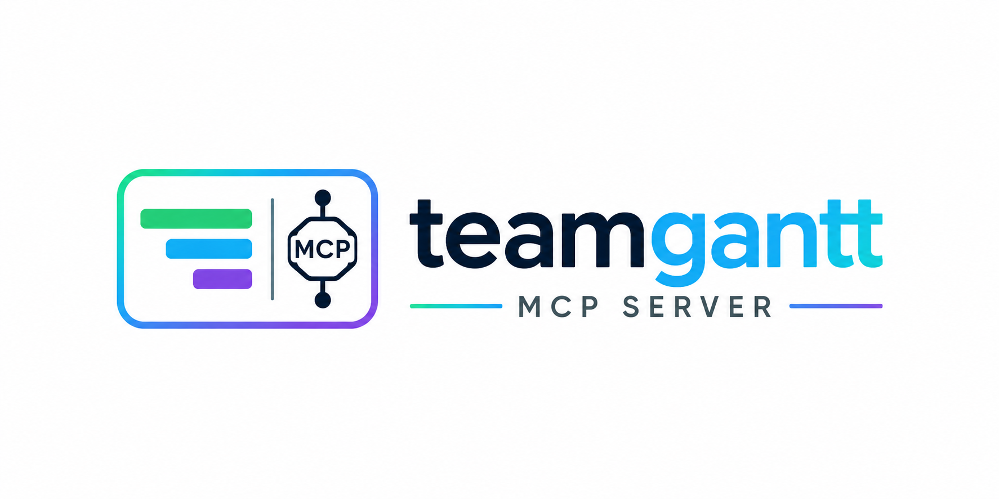

<div align="center">



**Give your AI assistant full control of TeamGantt.**

Plan projects, build task trees with dependencies, assign people, balance workload, and track time — through the [Model Context Protocol](https://modelcontextprotocol.io). **66 tools across 9 domains**, plus browsable `teamgantt://` resources, dual transports, and multi-tenant HTTP auth.

[](https://github.com/GrayNeel/teamgantt-mcp/actions/workflows/ci.yml)
[](https://github.com/GrayNeel/teamgantt-mcp/tags)
[](LICENSE)
[](https://nodejs.org)
[](https://www.typescriptlang.org)
[](https://github.com/modelcontextprotocol/typescript-sdk)

[**Features**](#-features) · [**Quick start**](#-quick-start) · [**Tools**](#-tools) · [**MCP resources**](#-mcp-resources) · [**Configuration**](#-configuration) · [**Architecture**](#-architecture) · [**Roadmap**](#-roadmap)

</div>

---

## ✨ Features

- 🧰 **66 tools, 9 domains** — projects, groups & tasks (dependencies, assignments, bulk create), comments & discussions, time tracking (timesheets + punch in/out), people & companies, resources, workload, health reports, webhooks.
- 🪶 **Context-friendly by design** — real TeamGantt payloads are huge (one measured project tree: **4.8 MB**). Every list/tree tool returns compact summaries (that tree becomes ~19 KB; a 4.7 MB task list ~16 KB per page), with client-side pagination as a guard where the live API ignores `per_page`. Detail tools stay full-fidelity.
- 📐 **Spec-faithful schemas** — tool inputs are extracted field-for-field from TeamGantt's official OpenAPI spec, then validated against live responses (several documented endpoints behave differently in production — those differences are baked in, not guessed).
- 📚 **MCP resources** — browse `teamgantt://projects`, `teamgantt://projects/{id}/tree`, and `teamgantt://current-user` from resource-aware clients.
- 🔌 **Two transports** — stdio for local clients (Claude Desktop, Claude Code, Cursor) and Streamable HTTP with session management, DNS-rebinding protection, and a `/healthz` probe.
- 🐳 **Runs anywhere** — one-command Docker Compose deployment; a small multi-stage, non-root `node:22-alpine` image exposes the HTTP server as a container.
- 🏢 **Multi-tenant HTTP auth** — each HTTP session can bring its own TeamGantt token via `Authorization: Bearer`; a server-side env token works as single-tenant fallback.
- ♻️ **Resilient client** — automatic retry on 429/5xx honoring `Retry-After`, and API errors surface as structured tool results with actionable hints instead of crashes.
- ✅ **Strict TypeScript, fully tested** — 46 tests including real client↔server MCP integration over in-memory and HTTP transports. No network in tests.

## 🚀 Quick start

```bash
git clone https://github.com/GrayNeel/teamgantt-mcp.git
cd teamgantt-mcp
npm install
npm run build
```

Create a TeamGantt personal access token at <https://app.teamgantt.com/admin/developers/tokens>, then:

```bash
export TEAMGANTT_API_TOKEN=your-token   # or copy .env.example to .env and use node --env-file=.env
node dist/index.js                      # stdio (default)
```

### Connect a client

**Claude Code**

```bash
claude mcp add teamgantt -e TEAMGANTT_API_TOKEN=your-token -- node /path/to/teamgantt-mcp/dist/index.js
```

**Claude Desktop / Cursor / any stdio client**

```json
{
  "mcpServers": {
    "teamgantt": {
      "command": "node",
      "args": ["/path/to/teamgantt-mcp/dist/index.js"],
      "env": { "TEAMGANTT_API_TOKEN": "your-token" }
    }
  }
}
```

**MCP Inspector (manual testing)**

```bash
TEAMGANTT_API_TOKEN=your-token npx @modelcontextprotocol/inspector node dist/index.js
```

### HTTP mode

```bash
node dist/index.js --http --port 3000
# MCP endpoint: http://127.0.0.1:3000/mcp   Health: http://127.0.0.1:3000/healthz
```

The server binds to 127.0.0.1 by default with DNS-rebinding protection; set `HOST=0.0.0.0` to accept external connections (needed in containers), and add any extra `Host` header values via `MCP_ALLOWED_HOSTS=host1,host2`.

**Multi-tenant:** each MCP session may authenticate with its own TeamGantt token by sending `Authorization: Bearer <personal access token>` on the initialize request — the session is bound to that token. Without the header the server falls back to `TEAMGANTT_API_TOKEN`; with neither, initialization is rejected with 401. (stdio mode always requires the env token.)

### Docker

Run the HTTP server in a container — no local Node install needed.

```bash
# 1. Provide a token (single-tenant fallback). Skip to require per-session tokens.
echo "TEAMGANTT_API_TOKEN=your-token" > .env

# 2. Build and start
docker compose up -d --build

# MCP endpoint: http://localhost:3000/mcp   Health: http://localhost:3000/healthz
```

The image is a multi-stage build on `node:22-alpine`, runs as a non-root user, ships only production dependencies plus the bundle, binds `0.0.0.0`, and includes a `/healthz` container healthcheck. Override the published port with `PORT=8080 docker compose up -d`.

Without Compose:

```bash
docker build -t teamgantt-mcp .
docker run -p 3000:3000 -e TEAMGANTT_API_TOKEN=your-token teamgantt-mcp
```

Point any HTTP MCP client at `http://localhost:3000/mcp`. In multi-tenant mode (no server-side token), each client sends its own `Authorization: Bearer <token>`.

## 🧰 Tools

<details>
<summary><strong>Projects</strong> (6 tools)</summary>

| Tool | Description |
|---|---|
| `list_projects` | List projects (status filter, search, pagination) |
| `get_project` | Full project details |
| `get_project_children` | Tree of groups and tasks inside a project |
| `create_project` | Create a project (optionally from a template) |
| `update_project` | Update name/status/settings |
| `archive_project` | Archive (soft-delete) a project |

</details>

<details>
<summary><strong>Tasks & groups</strong> (17 tools)</summary>

| Tool | Description |
|---|---|
| `list_tasks` | List tasks, filterable by project and date range |
| `get_task` | Single task details |
| `create_task` | Create a task or milestone (requires a `parent_group_id`) |
| `create_tasks_bulk` | Create up to 100 tasks in one call |
| `update_task` | Rename, reschedule, set progress, move between groups |
| `delete_task` | Permanently delete a task |
| `add_task_dependency` / `remove_task_dependency` | Manage FS/SS/FF/SF dependencies with lead/lag |
| `list_task_resources` / `assign_task_resource` / `update_task_assignment` / `remove_task_assignment` | Manage who works on a task and hour allocations |
| `list_groups` / `create_group` / `get_group` / `update_group` / `delete_group` | Manage the groups that contain tasks |

</details>

<details>
<summary><strong>Comments & discussions</strong> (6 tools)</summary>

| Tool | Description |
|---|---|
| `list_comments` | Read comments/notes on a task, group, or project |
| `create_comment` | Post a comment or note, optionally notifying users (@mentions) |
| `update_comment` / `delete_comment` | Edit or remove a comment |
| `pin_comment` | Pin/unpin a comment to the top of its list |
| `list_discussions` | Cross-project discussion inbox with unread/mention filters |

</details>

<details>
<summary><strong>Time tracking</strong> (11 tools)</summary>

| Tool | Description |
|---|---|
| `get_timesheets` | Timesheet view: hours per task per date |
| `set_timesheet_hours` | Set logged hours for a task on a date |
| `list_time_blocks` / `get_todays_time_blocks` / `get_open_time_blocks` | Inspect time entries |
| `get_active_time_block` | The currently running (punched-in) block |
| `create_time_block` | Record a completed time entry |
| `punch_in` / `punch_out` | Live time tracking |
| `update_time_block` / `delete_time_block` | Correct or remove entries |

</details>

<details>
<summary><strong>People & companies</strong> (9 tools)</summary>

| Tool | Description |
|---|---|
| `get_current_user` | Authenticated user's profile and companies (discover your user/company IDs) |
| `get_company` / `update_company` | Company details (plan, limits, account holders) and rename |
| `list_company_users` | All users in a company with permission levels |
| `get_company_user` | Single company user details |
| `invite_company_user` | Invite or add a user to the company |
| `update_company_user` / `remove_company_user` | Change permissions/disable, or remove from the company |
| `list_company_projects` | All projects in one company |

</details>

<details>
<summary><strong>Resources</strong> (11 tools)</summary>

| Tool | Description |
|---|---|
| `get_project_resource_options` | Everything assignable to tasks in a project (users + resources) |
| `list_project_resources` / `create_project_resource` / `update_project_resource` / `delete_project_resource` | Manage project-specific resources (labels) |
| `list_company_resources` / `create_company_resource` / `update_company_resource` / `delete_company_resource` | Manage company-wide resources (equipment, rooms) |
| `add_company_resource_to_project` / `remove_company_resource_from_project` | Control which company resources a project can use |

</details>

<details>
<summary><strong>Workload</strong> (3 tools)</summary>

| Tool | Description |
|---|---|
| `get_user_workload` | Allocated hours per day/week/month for one or more users |
| `get_unassigned_workload` | Hours on tasks with no assignee |
| `get_resource_workload` | Allocated hours for company or project resources |

</details>

<details>
<summary><strong>Reports & webhooks</strong> (3 tools)</summary>

| Tool | Description |
|---|---|
| `get_project_health` | Task-status breakdown and weighted percent complete per project |
| `list_webhooks` | Webhook subscriptions created by the current user |
| `create_webhook` | Subscribe a URL to project task events (the API has no delete endpoint) |

</details>

## 📚 MCP resources

Read-only resources under the `teamgantt://` scheme, for clients that browse resources:

| URI | Content |
| --- | --- |
| `teamgantt://current-user` | Profile and companies of the authenticated user |
| `teamgantt://projects` | Compact list of active projects |
| `teamgantt://projects/{projectId}` | Full details of one project |
| `teamgantt://projects/{projectId}/tree` | Group tree with per-group task counts |

## 🔧 Configuration

| Variable | Required | Default | Description |
|---|---|---|---|
| `TEAMGANTT_API_TOKEN` | stdio only | — | TeamGantt personal access token (in HTTP mode it's the fallback for sessions that don't send their own bearer token) |
| `TEAMGANTT_BASE_URL` | — | `https://api.teamgantt.com` | API origin override |
| `PORT` | — | `3000` | HTTP transport port (or `--port`) |
| `HOST` | — | `127.0.0.1` | HTTP bind interface; set `0.0.0.0` to accept external/container connections |
| `MCP_ALLOWED_HOSTS` | — | — | Extra allowed Host headers for HTTP transport |
| `LOG_LEVEL` | — | `info` | `error` \| `warn` \| `info` \| `debug` |

## 🧱 Architecture

```
src/
├── index.ts          CLI entry (--stdio default | --http [--port])
├── server.ts         Builds the McpServer and registers all tool modules
├── mcp-resources.ts  Read-only teamgantt:// resources
├── config.ts         Env parsing and validation
├── client/           Thin TeamGantt HTTP client (auth, retries, typed errors)
├── schemas/          Zod input schemas per API domain
├── tools/            One self-contained tool module per API domain
└── transports/       stdio and Streamable HTTP (session-based) transports
```

**Adding a new API domain** is mechanical:

1. Add `src/schemas/<domain>.ts` with the Zod input shapes.
2. Add `src/tools/<domain>.ts` exporting a `ToolModule` that calls `server.registerTool(...)` for each endpoint.
3. Add the module to `TOOL_MODULES` in `src/server.ts`.

Cross-cutting behavior (bearer auth, `429`/`5xx` retry with `Retry-After`, error mapping to `isError` tool results with actionable hints) lives in the shared client and `tools/types.ts` — tool modules stay declarative.

**Response trimming** (`src/tools/trim.ts`): raw TeamGantt responses are enormous — a single task is ~17 KB and a project tree can exceed 4 MB. List tools return compact summaries (measured against a real 2 370-task project: task list 4.7 MB → ~16 KB per page, project tree 4.8 MB → ~19 KB), tree tools return a groups-only skeleton with per-group task counts, and `list_tasks` enforces pagination client-side because the live API has been observed ignoring `per_page`. Detail tools (`get_project`, `get_task`) return the full payload.

## 🧪 Development

```bash
npm run typecheck   # tsc --noEmit
npm run lint        # eslint
npm test            # vitest (unit + in-memory & HTTP MCP integration tests)
npm run build       # tsup → dist/
```

Tests never hit the network: the HTTP client takes an injectable `fetchFn`, and integration tests wire a real MCP client to the real server over in-memory and HTTP transports.

## 🧭 Roadmap

Milestones **M1–M4 are shipped** (v0.5.0): projects/tasks/time tracking → response trimming → comments & discussions → people/resources/workload → reports, webhooks, MCP resources, multi-tenant HTTP auth.

Planned next: task detail & content (checklists, documents, history), planning & analysis (critical path, baselines, RACI), sharing & access control, Kanban boards, company configuration & templates, and custom fields.

**See [ROADMAP.md](ROADMAP.md)** for the full milestone plan with per-milestone scope and endpoints.

## 📄 License

[MIT](LICENSE)
